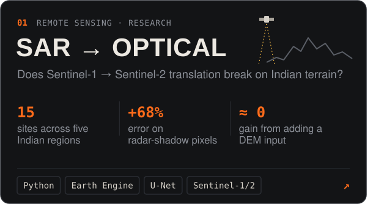
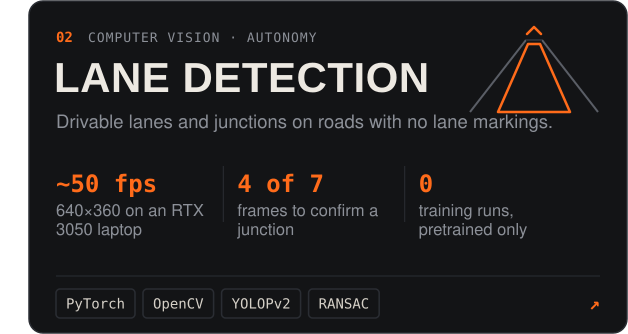
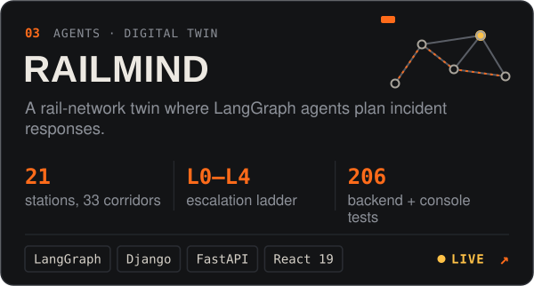
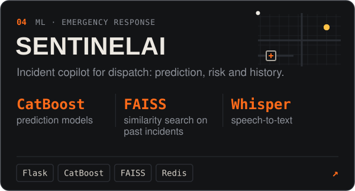
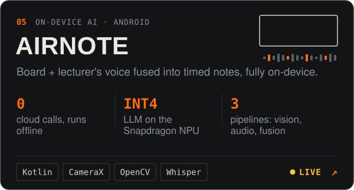
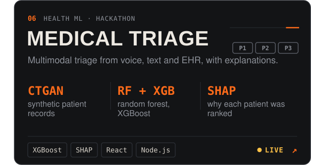
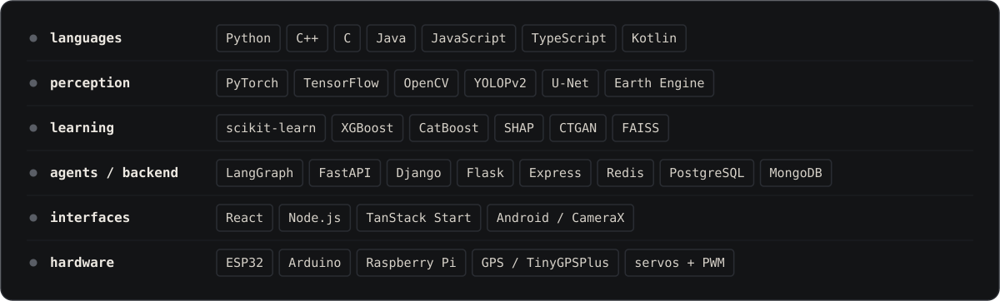
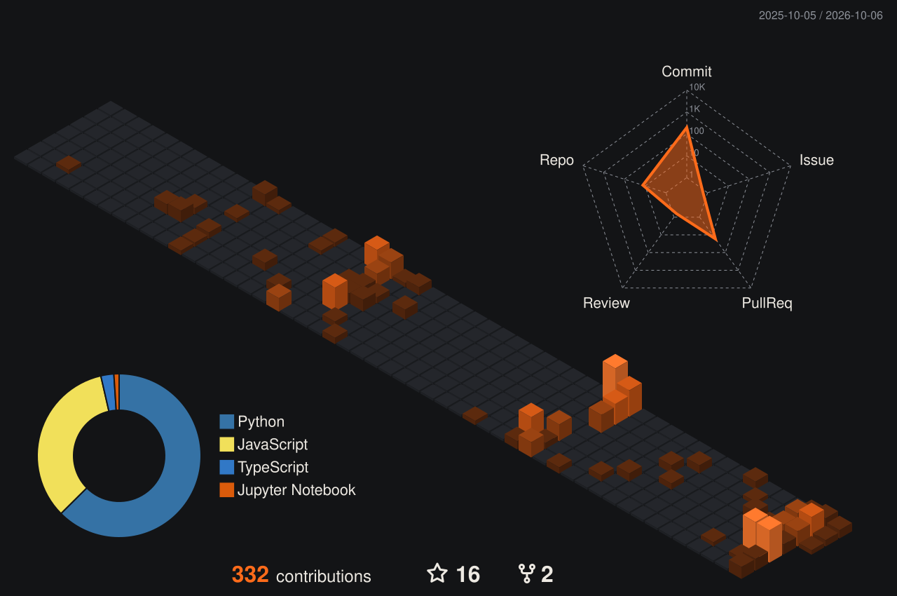
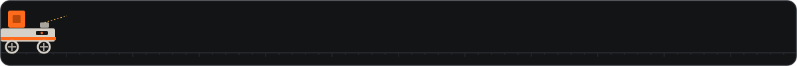

<a href="https://coder-praneeth.github.io/portfolio/">
  
</a>

<p align="center">
  <a href="https://coder-praneeth.github.io/portfolio/"></a>&nbsp;
  <a href="https://www.linkedin.com/in/praneeth-maheswaran"></a>&nbsp;
  <a href="mailto:praneethmaheshwaran@gmail.com"></a>
</p>

## <samp>about</samp>

I'm a CSE undergrad at SASTRA (class of 2028) who likes the point where a model leaves the notebook and meets the real world: roads with no lane markings, satellite passes under monsoon cloud, a rail network in the middle of an incident. I build the whole path, from dataset and model to the service and the screen someone actually uses, and the rest of my time goes to ESP32s and servos.

```yaml
# rostopic echo /praneeth
research:  SAR → optical translation over Indian terrain
recent:    [lane detection on unmarked roads, AirNote, RailMind]
hardware:  [ESP32 GPS telemetry, 3-DOF robotic arm]
```

## <samp>projects</samp>

<p align="center">
  <a href="https://github.com/coder-PRANEETH/sar2optical-terrain-india"></a>
  <a href="https://github.com/coder-PRANEETH/Lane-Detection"></a>
  <a href="https://github.com/coder-PRANEETH/Railmind"></a>
  <a href="https://github.com/coder-PRANEETH/SentinelAI"></a>
  <a href="https://github.com/coder-PRANEETH/AirNote"></a>
  <a href="https://github.com/coder-PRANEETH/Pragyan_Hackathon"></a>
</p>

| also built | |
|---|---|
| [**nalam-ecommerce**](https://github.com/coder-PRANEETH/nalam-ecommerce) · [live](https://nalam-ecommerce.vercel.app) | MERN grocery store with an admin dashboard, Razorpay checkout and OTP sign-in over Nodemailer |
| [**srt-dashboard**](https://github.com/coder-PRANEETH/srt-dashboard) | two ESP32s: one streams GPS fixes as JSON, the other hosts a Wi-Fi dashboard from LittleFS |
| [**number-classification**](https://github.com/coder-PRANEETH/number-classification) | a CNN written from scratch in NumPy, forward and backward passes by hand, on MNIST |
| [**pneumonia-detection**](https://github.com/coder-PRANEETH/pneumonia-detection) | pneumonia detection model in Python |
| [**mail-spam-classification**](https://github.com/coder-PRANEETH/mail-spam-classification) | email spam classifier |
| [**expense-tracker**](https://github.com/coder-PRANEETH/expense-tracker) | full-stack expense tracker with a separate frontend and backend |

## <samp>stack</samp>



## <samp>activity</samp>

<a href="https://github.com/coder-PRANEETH?tab=repositories">
  
</a>


